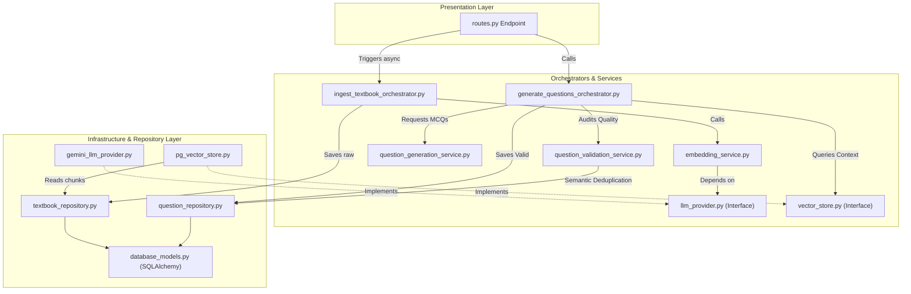

# Walkthrough: Question Ingestion and Generation API

We have successfully implemented the entire end-to-end question ingestion, RAG, and AI generation pipeline. The codebase strictly adheres to **Clean Architecture** patterns, leveraging dependency inversion, modular use-case orchestrators, and a multi-tiered validation structure with vector-based semantic deduplication.

---

## 🏗️ Systems Architecture

The diagram below illustrates how information flows through the decoupled presentation, application, domain, and repository layers:



---

## 📝 Files Configured

All codebase files have been populated and saved successfully:

### Core Abstractions (Application Interfaces)
1.  [vector_store.py](file:///c:/Users/shussain01/Desktop/Git_muzzu47/oea-backend-1/src/question_generation/application/interfaces/vector_store.py) — Interface for vector DB retrieval.
2.  [llm_provider.py](file:///c:/Users/shussain01/Desktop/Git_muzzu47/oea-backend-1/src/question_generation/application/interfaces/llm_provider.py) — Interface for text and embedding API queries.

### Concrete Infrastructure
3.  [gemini_llm_provider.py](file:///c:/Users/shussain01/Desktop/Git_muzzu47/oea-backend-1/src/question_generation/application/services/gemini_llm_provider.py) — Google `google-genai` Flash/Embedding client API driver.
4.  [pg_vector_store.py](file:///c:/Users/shussain01/Desktop/Git_muzzu47/oea-backend-1/src/question_generation/repository/pg_vector_store.py) — PostgreSQL + `pgvector` adapter performing cosine similarity queries.
5.  [database_models.py](file:///c:/Users/shussain01/Desktop/Git_muzzu47/oea-backend-1/src/question_generation/repository/database_models.py) — Schema definitions including `QuestionModel` with a `Vector(768)` embedding column.
6.  [question_repository.py](file:///c:/Users/shussain01/Desktop/Git_muzzu47/oea-backend-1/src/question_generation/repository/question_repository.py) — Data-access routines including SQL queries checking cosine distance thresholds.

### Business Logic Services
7.  [embedding_service.py](file:///c:/Users/shussain01/Desktop/Git_muzzu47/oea-backend-1/src/question_generation/application/services/embedding_service.py) — Manages chunk embeddings.
8.  [question_generation_service.py](file:///c:/Users/shussain01/Desktop/Git_muzzu47/oea-backend-1/src/question_generation/application/services/question_generation_service.py) — Constructs prompt guides and sanitizes JSON outputs.
9.  [question_validation_service.py](file:///c:/Users/shussain01/Desktop/Git_muzzu47/oea-backend-1/src/question_generation/application/services/question_validation_service.py) — Pipelines validation rules sequentially.

### Validation Engine (Structural & AI Checks)
10. [validator_result.py](file:///c:/Users/shussain01/Desktop/Git_muzzu47/oea-backend-1/src/question_generation/question_validation/validator_result.py) — Standard validation container.
11. [option_validator.py](file:///c:/Users/shussain01/Desktop/Git_muzzu47/oea-backend-1/src/question_generation/question_validation/option_validator.py) — Formats, option count, and unique check rules.
12. [explanation_validator.py](file:///c:/Users/shussain01/Desktop/Git_muzzu47/oea-backend-1/src/question_generation/question_validation/explanation_validator.py) — Verifies solution descriptive length.
13. [duplicate_validator.py](file:///c:/Users/shussain01/Desktop/Git_muzzu47/oea-backend-1/src/question_generation/question_validation/duplicate_validator.py) — Computes vector query distance to match database duplicates.
14. [bloom_validator.py](file:///c:/Users/shussain01/Desktop/Git_muzzu47/oea-backend-1/src/question_generation/question_validation/bloom_validator.py) — Audits Blooms level cognitively via LLM.
15. [difficulty_validator.py](file:///c:/Users/shussain01/Desktop/Git_muzzu47/oea-backend-1/src/question_generation/question_validation/difficulty_validator.py) — Evaluates question difficulty standard.

### Core Use Case Orchestrators
16. [ingest_textbook_orchestrator.py](file:///c:/Users/shussain01/Desktop/Git_muzzu47/oea-backend-1/src/question_generation/application/orchestrator/ingest_textbook_orchestrator.py) — Orchestrates raw textbook ingest.
17. [generate_questions_orchestrator.py](file:///c:/Users/shussain01/Desktop/Git_muzzu47/oea-backend-1/src/question_generation/application/orchestrator/generate_questions_orchestrator.py) — Orchestrates context gathering, generation batches, validation, and storage.

### Web Presentation Layer
18. [routes.py](file:///c:/Users/shussain01/Desktop/Git_muzzu47/oea-backend-1/src/question_generation/presentation/routes.py) — FastAPI endpoint handlers.
19. [main.py](file:///c:/Users/shussain01/Desktop/Git_muzzu47/oea-backend-1/src/main.py) — Entry point to boot API and auto-create DB tables.

---

## 🚀 How to Run and Test Locally

### 1. Start the Database
Spin up the local PostgreSQL database with the pgvector extension:
```bash
docker compose up -d
```

### 2. Configure Environment Variables
Set your Google Gemini API Key:
```powershell
# In PowerShell:
$env:GEMINI_API_KEY="your-api-key-here"

# In standard CMD:
set GEMINI_API_KEY=your-api-key-here
```

### 3. Start the Web Server
Launch the FastAPI development server:
```bash
python src/main.py
```
Your documentation will be available at `http://localhost:8000/docs`.

### 4. Test Ingestion Endpoint
Make a Form-data `POST` request to `http://localhost:8000/questions/ingest` with standard parameters:
*   `title`: "JEE Mechanics"
*   `subject_name`: "Physics"
*   `author`: "H.C. Verma"
*   `exam_type`: "JEE"
*   `file`: (Upload a local PDF file)

### 5. Test Question Generation Endpoint
Make a JSON `POST` request to `http://localhost:8000/questions/generate` with the body:
```json
{
  "subject": "Physics",
  "chapter": "Laws of Motion",
  "concept": "Newton's Second Law",
  "difficulty": "medium",
  "target_count": 5,
  "exam_type": "JEE"
}
```
The API will run the similarity vector search, prompt the LLM, audit the results, deduplicate, and return the database IDs of the generated questions!
